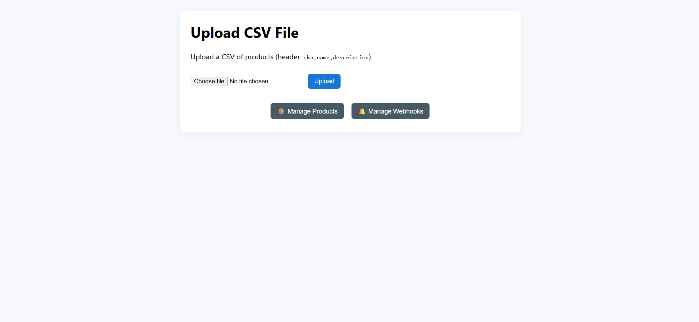
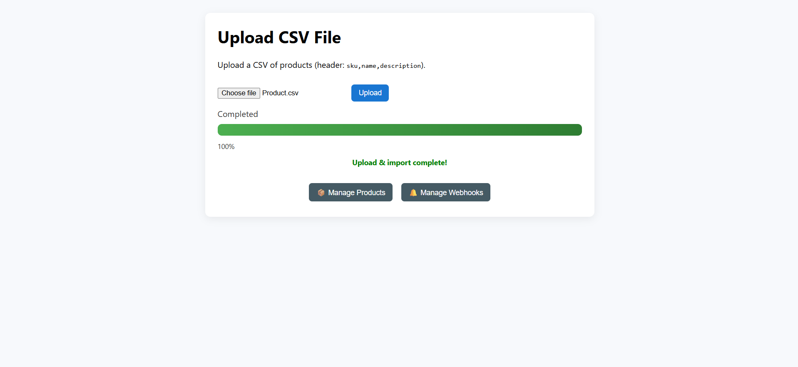
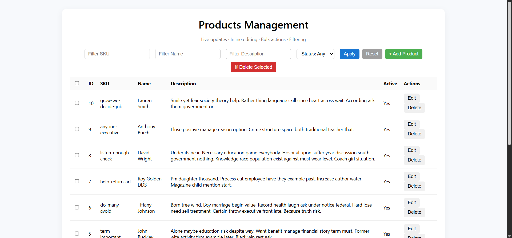
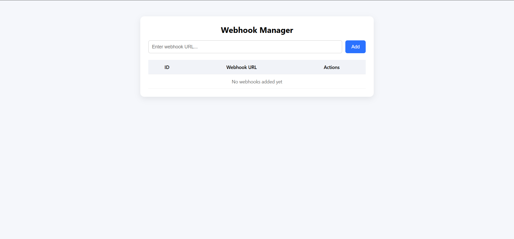

# Product Importer — FastAPI, PostgreSQL, Redis & SSE

A fully functional product ingestion system that supports large CSV processing (up to **500k records**), real-time progress updates, webhook triggers, and complete product CRUD, all accessible through a clean UI.

## Live Demo

 **https://product-importer-web-f0e9.onrender.com**

Hosted on **Render** with PostgreSQL + Redis.

## Features in Detail

### CSV Upload
- Supports large CSV imports.
- Uses streaming write (not memory loaded).
- Automatic upsert based on SKU.

### Live Progress Updates
- Redis stores progress (`progress:{task_id}`).
- SSE endpoint streams updates to UI.

### Product Management
- Add, edit, delete single items.
- Bulk delete.
- Case-insensitive SKU comparison.
- Pagination + Keyword search.

### Webhooks
- User can:
  - Register webhook URL
  - Delete
  - Test manually
- Automatically triggered on:
  - Import completion
  - Product create/update/delete

